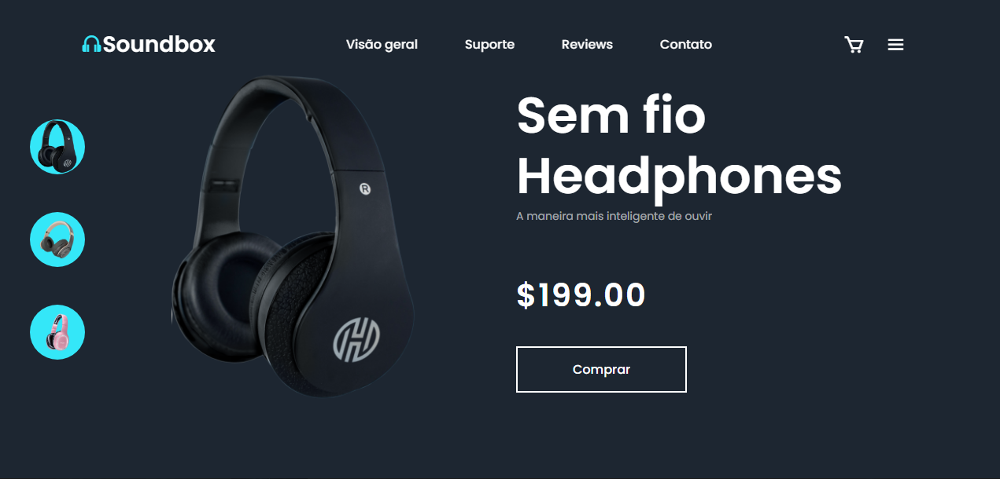

<h1 align='center'> Landing page para venda de headphones</h1> 

Uma landing page para expor produtos (headphone).
 

##

  
  

##

 A pagina funcional pode ser vista <a href='https://landing-page-para-venda-de-headphones.vercel.app/'>aqui</a>.

<h3 align='center'>Técnologias usadas:</h3> 

  
  
  
  
   

 
